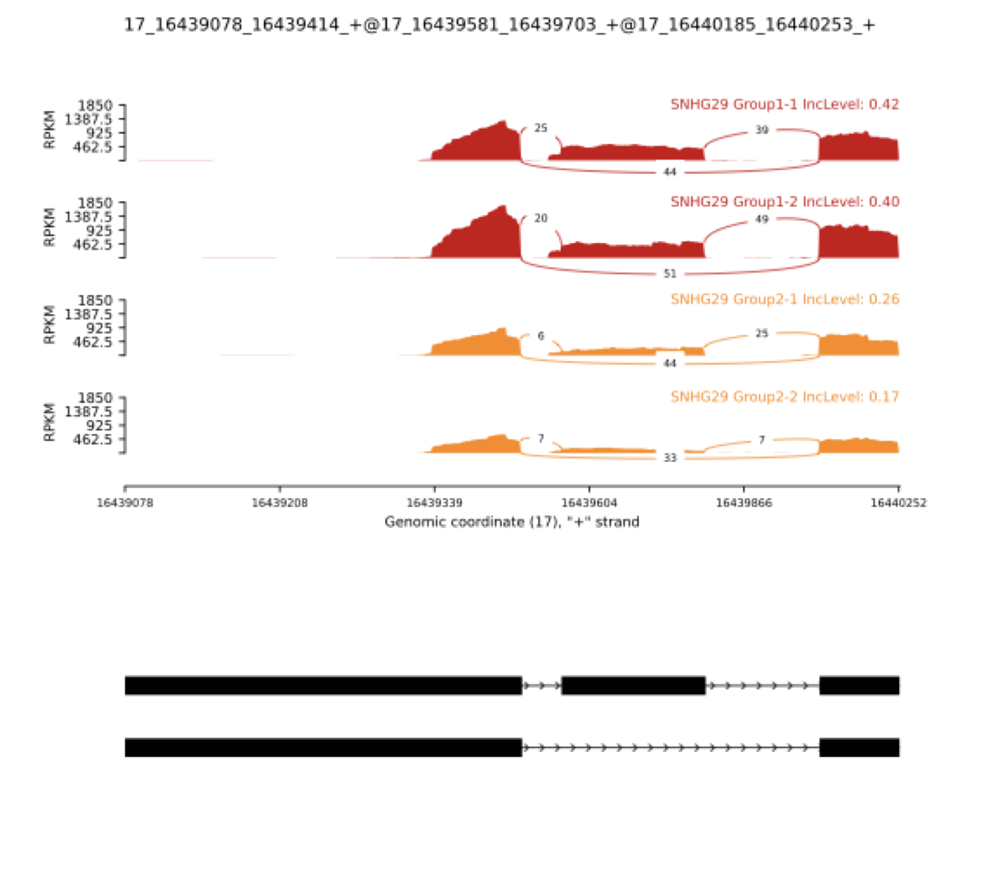

# 专题概述

标准差异表达分析（参见第4章）将每个基因的表达量视为单一数值，隐含地假设同一基因的所有转录本具有相同的生物学功能。然而，人类基因组中超过 90% 的多外显子基因会发生可变剪接（Alternative Splicing），同一基因的不同剪接异构体（Isoform）可以编码具有截然不同结构域组成、亚细胞定位甚至相互拮抗功能的蛋白质。将这些异构体的变化归并为基因层面的表达量，既损失了生物学信息，也可能掩盖真正的功能差异。本专题系统讲解可变剪接事件的七种类型、PSI（Percent Spliced-In）指标的统计定义，以及 rMATS 工具的贝叶斯检验框架；随后介绍另一类转录组结构变异——基因融合（Gene Fusion）的检测原理与 STAR-Fusion 分析流程。

**学习目标**：理解七种可变剪接事件类型的分子机制；掌握 PSI 指标的计算逻辑与 rMATS 的统计推断框架；能够解读 rMATS 输出文件的关键字段；了解基因融合的产生机制与 STAR-Fusion 的两步过滤策略。

---

# 可变剪接差异分析

## 可变剪接的生物学基础

真核生物 pre-mRNA 加工过程中，剪接体（Spliceosome）识别外显子-内含子边界并切除内含子。在绝大多数情况下，剪接并非"全有全无"的决定：同一转录前体可以通过不同的剪接方式产生多种成熟 mRNA，这一现象称为可变剪接。可变剪接是蛋白质组多样性的主要来源，使约 20,000 个人类编码基因能够产生超过 100,000 种蛋白质异构体。

{#fig-alternative-splicing width=85%}

图片引用自维基百科：[Alternative splicing](https://en.wikipedia.org/wiki/Alternative_splicing)

研究人员根据外显子与内含子的组合方式，将可变剪接事件归纳为七种基本类型：

- **外显子跳跃（Skipped Exon, SE）**：一个或多个内部外显子在部分转录本中被整体跳过，是人类基因组中最常见的可变剪接类型（约占所有事件的 40%）。
- **可变 5' 剪接位点（Alternative 5' Splice Site, A5SS）**：同一外显子的 5' 端（即供体位点）存在两个竞争性剪接位点，导致外显子长度在不同转录本中出现差异。
- **可变 3' 剪接位点（Alternative 3' Splice Site, A3SS）**：与 A5SS 对称，受体位点存在两种选择，外显子的 3' 边界可变。
- **内含子保留（Retained Intron, RI）**：正常情况下被切除的内含子在部分转录本中被保留。内含子保留在植物和酵母中尤为常见；在人类细胞中，内含子保留常与转录本的核内滞留和降解调控相关。
- **互斥外显子（Mutually Exclusive Exons, MXE）**：在同一基因内，某两个外显子在任何给定的转录本中最多只有一个被纳入，二者互相排斥。
- **可变第一外显子（Alternative First Exon, AFE）**：基因使用不同的第一个外显子作为转录起始点，导致转录本具有不同的 5' 非翻译区（5' UTR），进而影响翻译效率和 mRNA 稳定性，有时还会改变蛋白质 N 端序列。AFE 通常与不同启动子的差异性使用直接相关。
- **可变末尾外显子（Alternative Last Exon, ALE）**：基因使用不同的末尾外显子作为转录终止点，产生具有不同 3' UTR 或不同 C 端编码序列的转录本。ALE 通过改变 3' UTR 中的调控元件（如 miRNA 结合位点、多聚腺苷酸化信号）来调节转录本的稳定性和定位。

:::tip
**理解各事件类型的记忆策略：** SE 是"丢外显子"，A5SS/A3SS 是"边界模糊"，RI 是"留内含子"，MXE 是"二选一"，AFE 是"换开头"，ALE 是"换结尾"。在实践中，SE 事件通常具有最高的信噪比，是差异剪接分析的主要目标；RI 事件常见于应激响应与非编码 RNA 调控研究；AFE/ALE 则是解析启动子多样性与 3' UTR 调控的重要切入点。
:::

## PSI 指标：量化剪接选择的比率

要将剪接事件转化为可统计比较的数值，需要定义一个量化"外显子纳入程度"的指标。PSI（Percent Spliced-In，也写作 $\Psi$）衡量给定外显子被纳入成熟 mRNA 的比例：

$$\Psi = \frac{I}{I + S}$$

其中 $I$（Inclusion reads）为跨越该外显子两侧剪接位点的 junction reads 数量（即纳入该外显子的转录本产生的 reads），$S$（Skipping reads）为跨越该外显子所在区域但将其跳过的 junction reads 数量。PSI 值介于 0 和 1 之间：$\Psi = 1$ 表示所有转录本均纳入该外显子；$\Psi = 0$ 表示该外显子在所有转录本中均被跳过；中间值反映细胞群体中两种剪接模式的比例混合。

差异剪接分析的核心是比较两组样本的 $\Delta\Psi = \Psi_{\text{treatment}} - \Psi_{\text{control}}$：显著的正 $\Delta\Psi$ 意味着处理后外显子纳入增加，负值意味着减少。

:::note
**PSI 的局限性：** PSI 是群体平均值，反映的是样品中所有细胞的剪接比例混合。在肿瘤样本或细胞异质性较高的组织中，PSI 的变化可能来自细胞组成的改变（如某类细胞比例升高），而非剪接调控本身的变化。单细胞层面的可变剪接分析（scRNA-seq）是解决这一问题的前沿方向，但目前方法仍不成熟。
:::

## rMATS：基于贝叶斯框架的差异剪接检验

rMATS（replicate Multivariate Analysis of Transcript Splicing）是目前最广泛使用的可变剪接差异分析工具。与早期工具相比，rMATS 的核心改进在于：（1）专门设计用于处理**有重复样本**的实验设计，能够对样本间的 PSI 变异进行统计建模；（2）使用 **Beta 二项分布**（Beta-Binomial distribution）而非简单二项分布，更好地捕捉生物学重复之间的过度离散（overdispersion）现象。

**rMATS 的统计推断流程**：可以将整个流程理解为四个递进的问题——"数清楚有多少 reads" → "把比例上的随机波动建模出来" → "估计两组到底差多少" → "判断这个差异是不是偶然"。

1. **读段计数**：对每个可变剪接事件，统计每个样本的 inclusion junction reads（$I_k$，支持纳入外显子）和 skipping junction reads（$S_k$，支持跳过外显子）。单个样本的 PSI 即由这两个数算出：$\Psi_k = I_k / (I_k + S_k)$。这一步的本质是把"剪接选择"转化为一个"成功/失败"的计数问题——每条 junction read 都是一次投票，投给"纳入"或"跳过"。
2. **Beta 二项分布建模**：关键在于 PSI 不是一个固定常数。即使在同一实验条件下，不同生物学重复测得的 PSI 也会有波动，这种"重复之间比例本身就在变"的现象称为过度离散（overdispersion）。rMATS 用两层结构刻画它：内层用二项分布描述"给定真实纳入概率时，$I_k$ 在总 reads 中的随机抽样"；外层用 Beta 分布描述"各重复的真实纳入概率本身围绕组均值的散布"。两层叠加即 Beta 二项分布——读段越少、重复间波动越大，模型给出的不确定性就越大。
3. **$\Delta\Psi$ 的后验估计**：在上述模型下，通过贝叶斯推断同时估计两组的 PSI 均值，并直接得到两者之差 $\Delta\Psi = \Psi_1 - \Psi_2$ 的后验分布。报告的不是一个孤立的点估计，而是后验均值加置信区间——区间越窄，说明该事件的 reads 支持越充分、估计越可信。
4. **显著性检验**：rMATS 检验的不是"$\Delta\Psi$ 是否恰好为 0"，而是"差异是否大到具有生物学意义"。它计算后验分布中 $|\Delta\Psi| > \delta$（阈值通常取 $\delta = 0.05$）的概率，据此给出 P 值，再经多重检验校正得到 FDR。因此一个事件要被判为显著，需同时满足两点：差异幅度足够大（$|\Delta\Psi|$ 超过阈值）且证据足够稳（FDR 足够小）。

:::info
**黄金法则：幅度与置信缺一不可。** rMATS 的输出永远要同时看 `IncLevelDifference`（$\Delta\Psi$，差异多大）和 `FDR`（差异多可信）。一个 $\Delta\Psi = 0.6$ 但 reads 极少、FDR 接近 1 的事件不可信；一个 FDR 极小但 $\Delta\Psi$ 只有 0.02 的事件虽统计显著却几乎没有生物学意义。真正值得关注的是两者皆达标的事件。
:::

rMATS 支持两种计数模式，对应两个输出文件系列：

- **JC（Junction Counts only）**：仅使用跨越剪接位点的 junction reads，对外显子长度变化不敏感，推荐作为主要分析依据。
- **JCEC（Junction Counts and Exon body Counts）**：同时纳入外显子体内的 reads，信号更强但对 reads 的均匀覆盖有依赖，适合外显子较长的事件。

## 实践：rMATS 差异剪接分析

### 环境准备与输入数据

rMATS 在解析 junction reads 时依赖比对器写入的剪接信息与链向标签（`XS`），其官方测试基准与推荐流程均基于 STAR。因此本专题不复用第4章的 HISAT2 比对结果，而是用 STAR 对同一批 airway 数据（气道平滑肌细胞，参见第4章）重新比对。下面对 5 个双端样本（经 fastp 质控修剪）逐一比对，输出统一存放于 `bulkRNA/STAR/`。

首先需要 STAR 基因组索引。若尚未构建，可用基因组 FASTA 生成（本例的本地索引位于 `ref/star_index/`）：

```bash
REF="/Users/angdong/Documents/bio_example/bulkRNA/ref"
STAR_INDEX="${REF}/star_index"

# Build the genome index (run once; needs ~30 GB RAM for the human genome).
# Supplying --sjdbGTFfile here pre-inserts annotated junctions and improves
# junction sensitivity; omit it to build an annotation-free index and let STAR
# detect splice junctions de novo (sufficient for rMATS event quantification).
STAR --runMode genomeGenerate \
     --runThreadN 8 \
     --genomeDir "${STAR_INDEX}" \
     --genomeFastaFiles "${REF}/Homo_sapiens.GRCh38.dna.primary_assembly.fa"
```

然后对 5 个双端样本（经 fastp 质控修剪）逐一比对：

```bash
STAR_INDEX="/Users/angdong/Documents/bio_example/bulkRNA/ref/star_index"
FASTP_DIR="/Users/angdong/Documents/bio_example/bulkRNA/qc/fastp"
STAR_DIR="/Users/angdong/Documents/bio_example/bulkRNA/STAR"
mkdir -p "${STAR_DIR}"

# --outSAMstrandField intronMotif writes the XS tag rMATS uses for strand inference.
for S in SRR1039508 SRR1039510 SRR1039512 SRR1039514 SRR1039516; do
    STAR --runThreadN 8 \
         --genomeDir "${STAR_INDEX}" \
         --readFilesIn "${FASTP_DIR}/${S}_1_1M_trimmed.fastq.gz" \
                       "${FASTP_DIR}/${S}_2_1M_trimmed.fastq.gz" \
         --readFilesCommand "gunzip -c" \
         --outSAMtype BAM SortedByCoordinate \
         --outSAMstrandField intronMotif \
         --alignSJoverhangMin 8 \
         --outFilterMismatchNmax 999 \
         --alignIntronMin 20 \
         --alignIntronMax 1000000 \
         --outFileNamePrefix "${STAR_DIR}/${S}_"
    samtools index "${STAR_DIR}/${S}_Aligned.sortedByCoord.out.bam"
done
```

:::note
**`--readFilesCommand` 的写法：** STAR 通过该参数调用外部命令解压输入。在 macOS（zsh）下 `zcat` 默认仅识别 `.Z` 后缀，应使用 `"gunzip -c"`；Linux/bash 环境则两者皆可。
:::

得到比对结果后，将样本写入 rMATS 的分组清单。rMATS 对样本数要求宽松，但建议每组至少 2 个重复以获得可靠的 Beta 二项分布参数估计。

:::warning
**关于本演示的分组：** 本地 PE 数据中仅 SRR1039516 为 dexamethasone 处理样本，无法构成处理组的生物学重复。因此下面将 4 个 untreated 样本人为拆分为两组（508/510 与 512/514），仅用于**演示 rMATS 的完整运行与统计流程**，其本质是一次零假设（null）对比，不应据此得出生物学结论。在真实研究中，两组应对应不同实验条件（如 dex 处理 vs 未处理）。
:::

```bash
STAR_DIR="/Users/angdong/Documents/bio_example/bulkRNA/STAR"

# Group 1: SRR1039508, SRR1039510
printf "${STAR_DIR}/SRR1039508_Aligned.sortedByCoord.out.bam,\
${STAR_DIR}/SRR1039510_Aligned.sortedByCoord.out.bam" > group1_bams.txt

# Group 2: SRR1039512, SRR1039514
printf "${STAR_DIR}/SRR1039512_Aligned.sortedByCoord.out.bam,\
${STAR_DIR}/SRR1039514_Aligned.sortedByCoord.out.bam" > group2_bams.txt
```

### 运行 rMATS

rMATS（rmats-turbo）通过 `rmats.py` 调用。一次完整运行依次完成三件事：解析比对文件、统计各类事件的 junction reads、对 PSI 差异执行 Beta 二项检验。

```bash
GTF="/Users/angdong/Documents/bio_example/bulkRNA/ref/GRCh38.109.gtf"
OUTPUT_DIR="rmats_output"
TMP_DIR="rmats_tmp"
mkdir -p ${OUTPUT_DIR} ${TMP_DIR}

# --readLength 63 matches the airway PE63 reads; --variable-read-length
# is required because fastp trimming produces reads shorter than 63 bp.
rmats.py \
    --b1 group1_bams.txt \
    --b2 group2_bams.txt \
    --gtf ${GTF} \
    --od ${OUTPUT_DIR} \
    --tmp ${TMP_DIR} \
    -t paired \
    --readLength 63 \
    --variable-read-length \
    --nthread 6
```

:::tip
**计数与统计的分离：** 加上 `--statoff` 可只输出各事件的 read 计数与 PSI 值而跳过统计检验，适用于仅需 PSI 的下游分析。对于大规模队列，rMATS 还支持 `--task prep`（对每个样本单独预处理并缓存到 `--tmp`）与 `--task post`（在缓存基础上完成计数与统计）两阶段拆分，从而在多个比较组之间复用同一批样本的预处理结果，节省计算时间。
:::

### 解读输出文件

```bash
# List output files
ls ${OUTPUT_DIR}/*.JC.txt
# SE.MATS.JC.txt  A5SS.MATS.JC.txt  A3SS.MATS.JC.txt
# RI.MATS.JC.txt  MXE.MATS.JC.txt

# Preview the key SE columns (gene, exon coords, junction counts, stats)
cut -f3,6,7,13-16,19-23 ${OUTPUT_DIR}/SE.MATS.JC.txt | head -3 | column -t
```

rMATS 输出的关键字段说明（以 `SE.MATS.JC.txt` 为例）：

| 字段 | 含义 |
|---|---|
| `GeneID` | Ensembl 基因 ID |
| `geneSymbol` | 基因名称 |
| `exonStart_0base`, `exonEnd` | 目标可变外显子的坐标（0-based） |
| `IJC_SAMPLE_1` / `SJC_SAMPLE_1` | 组1各样本的 inclusion / skipping junction read 计数（逗号分隔） |
| `IncLevel1` / `IncLevel2` | 组1和组2各样本的 PSI 值 |
| `IncLevelDifference` | $\Delta\Psi = \overline{\Psi_1} - \overline{\Psi_2}$ |
| `PValue` / `FDR` | 统计显著性 |

### 筛选显著差异剪接事件

```r
library(dplyr)
library(ggplot2)

# Read SE results
se <- read.table("/Users/angdong/Documents/bio_example/bulkRNA/rmats_output/SE.MATS.JC.txt",
                 header = TRUE, sep = "\t", stringsAsFactors = FALSE)

# Filter: |dPSI| > 0.1 and FDR < 0.05 with sufficient read coverage
sig_se <- se |>
    filter(
        abs(IncLevelDifference) > 0.1,
        FDR < 0.05,
        # Require mean >= 10 junction reads across samples in each group
        sapply(strsplit(as.character(IJC_SAMPLE_1), ","),
               function(x) mean(as.numeric(x), na.rm = TRUE)) >= 10,
        sapply(strsplit(as.character(IJC_SAMPLE_2), ","),
               function(x) mean(as.numeric(x), na.rm = TRUE)) >= 10
    ) |>
    arrange(FDR)

cat("Significant SE events:", nrow(sig_se), "\n")
head(sig_se[, c("geneSymbol", "IncLevelDifference", "FDR")], 10)
```

```r
#| label: fig-rmats-volcano
#| fig-cap: "rMATS 可变外显子跳跃事件的火山图（真实数据，SE.MATS.JC.txt）。横轴为 ΔPSI，纵轴为 -log₁₀(FDR)，红色点为显著差异事件（|ΔPSI| > 0.1，FDR < 0.05）。本演示为零假设对照，绝大多数事件 FDR≈1（点密集分布于 y=0 一线），仅极少数点升起，这正是无真实生物学差异时的预期形态。"
library(dplyr)
library(ggplot2)

# Reuse the real SE results loaded above (rmats_output/SE.MATS.JC.txt)
se_plot <- se |>
    filter(!is.na(FDR), FDR > 0) |>
    mutate(
        neg_log10_fdr = -log10(FDR),
        significant = abs(IncLevelDifference) > 0.1 & FDR < 0.05
    )

ggplot(se_plot, aes(x = IncLevelDifference, y = neg_log10_fdr,
                    color = significant)) +
    geom_point(alpha = 0.5, size = 0.8) +
    scale_color_manual(values = c("grey70", "#d62728"),
                       labels = c("Not significant", "Significant")) +
    geom_vline(xintercept = c(-0.1, 0.1), linetype = "dashed",
               color = "grey40", linewidth = 0.5) +
    geom_hline(yintercept = -log10(0.05), linetype = "dashed",
               color = "grey40", linewidth = 0.5) +
    labs(x = expression(Delta*Psi ~ "(IncLevelDifference)"),
         y = expression(-log[10](FDR)),
         color = NULL) +
    theme_bw(base_size = 12) +
    theme(legend.position = "top")
```

#### 多事件类型的并排火山图

单张火山图只能展示一类剪接事件。`scRNAtoolVis` 包的 `jjVolcano()` 专为多组差异结果设计：它将每个分组（这里即 SE、A3SS、A5SS 三类剪接事件）绘制成一列，纵轴为差异幅度，正负分别对应 inclusion 升高与降低，并在中央用色块标注分组、自动为每组标注差异最显著的若干事件，从而在一张图中横向比较各类事件的整体差异分布。

`jjVolcano()` 的输入沿用 Seurat `FindAllMarkers()` 的列名约定，需要 `gene`、`avg_log2FC`、`cluster`、`p_val`、`p_val_adj` 五列。将 rMATS 字段映射过去即可：`geneSymbol → gene`、`IncLevelDifference (ΔPSI) → avg_log2FC`、事件类型 `→ cluster`、`PValue → p_val`、`FDR → p_val_adj`。

:::note
**依赖说明：** `scRNAtoolVis` 发布于 GitHub，需先安装：`remotes::install_github("junjunlab/scRNAtoolVis")`（依赖 `Seurat`、`ComplexHeatmap`、`jjAnno` 等）。本代码读取真实的 rMATS 输出文件，需先完成前述比对与 rMATS 分析。
:::

```r
#| label: fig-rmats-volcano-multi
#| fig-cap: "三类可变剪接事件（SE、A3SS、A5SS）的多组火山图（jjVolcano）。每列为一类事件，纵轴为 ΔPSI（avg_log2FC 列）；红/蓝点为 |ΔPSI| 超过阈值（±0.1）的 inclusion 升高（sigUp）与降低（sigDown）事件，中央色块标注事件类型，标签为各组 FDR 达标且 ΔPSI 最显著的若干事件。本演示为零假设对照，结果仅用于展示绘图流程。"
library(scRNAtoolVis)
library(dplyr)

rmats_dir <- "/Users/angdong/Documents/bio_example/bulkRNA/rmats_output"
events <- c("SE", "A3SS", "A5SS")

# Assemble a Seurat-FindAllMarkers-style table from the rMATS outputs
diff_data <- lapply(events, function(ev) {
    read.table(file.path(rmats_dir, paste0(ev, ".MATS.JC.txt")),
               header = TRUE, sep = "\t", stringsAsFactors = FALSE) |>
        filter(!is.na(FDR), !is.na(IncLevelDifference)) |>
        transmute(gene       = geneSymbol,
                  avg_log2FC = IncLevelDifference,   # dPSI on the y-axis
                  cluster    = ev,
                  p_val      = PValue,
                  p_val_adj  = FDR)
}) |>
    bind_rows() |>
    mutate(cluster = factor(cluster, levels = events))

# Multi-group volcano: dPSI cutoff 0.1, FDR cutoff 0.05, label top 5 per event
jjVolcano(diffData       = diff_data,
          log2FC.cutoff  = 0.1,
          adjustP.cutoff = 0.05,
          topGeneN       = 5,
          size           = 3,
          aesCol         = c("#1f77b4", "#d62728"),
          tile.col       = c("#8da0cb", "#66c2a5", "#fc8d62"),
          legend.position = "top") +
    ggplot2::ylab(expression(Delta*Psi))
```

### Sashimi 图可视化

Sashimi 图是可变剪接分析中最直观的可视化方式：横轴为基因组坐标，纵轴为覆盖深度，弧线连接两个剪接位点，弧线粗细（或标注数字）代表跨越该连接的 junction reads 数量。从 Sashimi 图中，读者可以直观地看到处理组与对照组在某一外显子两侧 junction reads 数量的差异，从而验证 rMATS 统计结果是否与覆盖度模式一致。

rmats2sashimiplot 直接读取 rMATS 的事件结果文件（`-e`），并按其中记录的外显子坐标作图。最方便的做法是从完整的 `SE.MATS.JC.txt` 中抽取目标事件（连同表头）写入一个子集文件，再传给 `-e`。下面以 SNHG29 基因（`ENSG00000175061`）中 FDR 最低、$\Delta\Psi$ 最大的可变外显子跳跃事件（ID 11851）为例：

```bash
# Requires rmats2sashimiplot (conda install -c bioconda rmats2sashimiplot)
RM="/Users/angdong/Documents/bio_example/bulkRNA/rmats_output"
STAR_DIR="/Users/angdong/Documents/bio_example/bulkRNA/STAR"
OUT="/Users/angdong/Documents/bio_example/bulkRNA/sashimi_output"
mkdir -p "${OUT}"

# Extract the target SNHG29 SE event (ID 11851) together with the header line
head -1 "${RM}/SE.MATS.JC.txt" > "${OUT}/SNHG29_SE.txt"
awk -F'\t' '$1==11851' "${RM}/SE.MATS.JC.txt" >> "${OUT}/SNHG29_SE.txt"

# Build the comma-separated BAM lists for each group
B1="${STAR_DIR}/SRR1039508_Aligned.sortedByCoord.out.bam,${STAR_DIR}/SRR1039510_Aligned.sortedByCoord.out.bam"
B2="${STAR_DIR}/SRR1039512_Aligned.sortedByCoord.out.bam,${STAR_DIR}/SRR1039514_Aligned.sortedByCoord.out.bam"

# --remove-event-chr-prefix strips the "chr" in the event file (chr17) to match
# the Ensembl-style BAM contig names (17); drop it if your BAM uses "chr17".
rmats2sashimiplot \
    --b1 "${B1}" \
    --b2 "${B2}" \
    --event-type SE \
    -e "${OUT}/SNHG29_SE.txt" \
    --l1 Group1 \
    --l2 Group2 \
    --exon_s 1 --intron_s 5 \
    --min-counts 5 \
    --remove-event-chr-prefix \
    -o "${OUT}/SNHG29"
```

:::note
**两个易错点：** （1）事件类型参数为 `--event-type`（非 `-t`），且需配合 `-e` 传入 rMATS 事件文件，而非手动拼写坐标字符串。（2）本专题的 BAM 由 STAR 比对到 Ensembl GRCh38 参考，contig 名为 `17`，而 rMATS 输出沿用 `chr17`；二者不一致时 Sashimi 图会读不到 reads，须加 `--remove-event-chr-prefix` 将事件坐标对齐到 BAM 命名。
:::

运行后，图像以 PDF 形式输出至 `sashimi_output/SNHG29/Sashimi_plot/` 目录。@fig-sashimi-snhg29 即为该事件的结果。

{#fig-sashimi-snhg29 width=85%}

**结果解读：** 该事件的关键在于比较中段可变外显子两侧"纳入型"junction reads 的相对丰度。Group1 两个样本的纳入型 junction reads（约 25、20）明显高于 Group2（约 6、7），对应右侧标注的 PSI 值——Group1 为 0.42 与 0.40，Group2 为 0.26 与 0.17，组间 $\Delta\Psi \approx +0.18$。这一覆盖度与 junction 模式与 rMATS 的统计结果（IncLevelDifference = 0.195，FDR = 0.042）方向一致、量级吻合，说明该差异并非个别样本的离群表现，而是组内可重复的趋势。需要强调的是，本演示的分组本质上是零假设对照（详见前文 warning），此处的差异仅用于示范如何将 Sashimi 图与 rMATS 统计量交叉验证，不应作为 SNHG29 受 dexamethasone 调控的生物学证据。

### 差异剪接基因的 GO 富集分析

```r
library(clusterProfiler)
library(org.Hs.eg.db)

# Extract unique gene IDs from significant SE events
sig_genes_ensembl <- unique(sig_se$GeneID)

# Convert Ensembl to Entrez
gene_map <- bitr(sig_genes_ensembl,
                 fromType = "ENSEMBL",
                 toType   = "ENTREZID",
                 OrgDb    = org.Hs.eg.db)

# GO Biological Process enrichment
go_bp <- enrichGO(
    gene          = gene_map$ENTREZID,
    OrgDb         = org.Hs.eg.db,
    ont           = "BP",
    pAdjustMethod = "BH",
    pvalueCutoff  = 0.05,
    qvalueCutoff  = 0.2
)
```

```r
#| label: fig-se-go-dotplot
#| fig-cap: "差异剪接基因（SE 事件）的 GO 生物过程富集结果示意。实际分析中，气泡大小代表该通路中的差异剪接基因数量，颜色深浅代表调整后的 P 值。"
#| message: false
#| warning: false
# GO enrichment requires real rMATS output and org.Hs.eg.db.
# The block below shows the expected output format using the airway dataset
# as a stand-in so the document renders without external BAM files.
library(clusterProfiler)
library(org.Hs.eg.db)
library(airway)
library(DESeq2)

data(airway)
dds <- DESeqDataSet(airway, design = ~ cell + dex)
dds <- DESeq(dds)
res <- results(dds, contrast = c("dex", "trt", "untrt"))
sig_genes <- rownames(subset(res, padj < 0.05 & abs(log2FoldChange) > 1))

if (length(sig_genes) > 0) {
    gene_map <- bitr(sig_genes, fromType = "ENSEMBL",
                     toType = "ENTREZID", OrgDb = org.Hs.eg.db,
                     drop = TRUE)
    go_bp <- enrichGO(gene          = gene_map$ENTREZID,
                      OrgDb         = org.Hs.eg.db,
                      ont           = "BP",
                      pAdjustMethod = "BH",
                      pvalueCutoff  = 0.05,
                      qvalueCutoff  = 0.2)
    if (!is.null(go_bp) && nrow(go_bp@result) > 0) {
        dotplot(go_bp, showCategory = 15,
                title = "GO BP: DEGs from airway dex vs control (illustrative)")
    }
}
```

---

# 基因融合鉴定

## 基因融合的产生机制与临床意义

基因融合（Gene Fusion）是指两个在基因组上相互独立的基因，因染色体结构变异或转录异常而将其转录本拼接在一起，产生嵌合体转录本（Chimeric Transcript）的现象。根据产生机制，基因融合可分为四类：

- **染色体易位（Translocation）**：两条非同源染色体断裂后错误连接，使两个原本分处不同染色体的基因形成融合。BCR-ABL1 是最经典的例子——t(9;22) 易位（费城染色体）将 BCR 基因（22 号染色体）与 ABL1 酪氨酸激酶基因（9 号染色体）融合，产生组成型激活的融合蛋白，驱动慢性髓系白血病（CML）的发生。格列卫（伊马替尼）针对 BCR-ABL1 的靶向治疗是精准医学的里程碑。
- **染色体倒置（Inversion）**：同一染色体的一段发生 180° 翻转，使原本背靠背排列的两个基因产生融合。
- **染色体缺失（Deletion）**：两个串联基因之间的片段缺失，导致它们的编码区直接相连。TMPRSS2-ERG（前列腺癌中最常见的融合，约 50% 的病例阳性）即由 21q22 区域的缺失或倒置产生。
- **转录通读（Read-through Transcription）**：RNA 聚合酶越过基因的正常终止位点，继续转录下游基因，形成无需基因组结构变异的融合转录本。转录通读融合通常表达量较低，功能意义有争议。

:::note
**融合基因的临床意义：** 基因融合在肿瘤诊断中具有重要意义，原因有三：（1）融合事件在肿瘤细胞中高度特异，正常组织中罕见；（2）许多融合基因直接驱动肿瘤发生，是优良的治疗靶点；（3）融合基因是稳定的生物标志物，可通过 RNA-seq、RT-PCR 或 FISH 检测。COSMIC（Catalogue of Somatic Mutations in Cancer）数据库维护了已知驱动融合的列表，可作为分析结果解读的参考。
:::

## STAR-Fusion 的两步过滤策略

STAR-Fusion 依赖于 STAR 比对器在嵌合比对（Chimeric Alignment）模式下产生的跨基因边界读段。其检测流程分为两个阶段：

**第一阶段：STAR 嵌合比对**

通过以下参数启用 STAR 的嵌合比对模式，嵌合读段被记录在 `Chimeric.out.junction` 文件中：

```bash
STAR \
    --runMode alignReads \
    --genomeDir /path/to/star_genome \
    --readFilesIn sample_R1.fastq.gz sample_R2.fastq.gz \
    --readFilesCommand zcat \
    --outSAMtype BAM SortedByCoordinate \
    --chimSegmentMin 12 \
    --chimJunctionOverhangMin 8 \
    --chimOutType WithinBAM SeparateSAMold \
    --chimOutJunctionFormat 1 \
    --alignSJDBoverhangMin 10 \
    --alignMatesGapMax 100000 \
    --alignIntronMax 100000 \
    --runThreadN 8 \
    --outFileNamePrefix star_output/
```

**第二阶段：STAR-Fusion 过滤**

原始嵌合比对中含有大量假阳性。STAR-Fusion 对其进行系统过滤：（1）与 CTAT 资源库中已知假阳性融合数据库比对，去除重复区域和旁系同源基因对产生的假融合；（2）通过 FusionInspector 模块，在局部重建的融合转录本参考序列上对候选支持读段进行精确重比对验证；（3）过滤 FFPM（Fusion Fragments Per Million）低于 0.1 的低表达融合事件。

```bash
# Run STAR-Fusion after STAR alignment
CTAT_LIB="/path/to/GRCh38_gencode_v37_CTAT_lib"

STAR-Fusion \
    --genome_lib_dir ${CTAT_LIB} \
    --chimeric_junction star_output/Chimeric.out.junction \
    --output_dir star_fusion_output \
    --examine_coding_effect \
    --FusionInspector validate \
    --CPU 8
```

### 解读 STAR-Fusion 输出

```r
# Read main output file
fusions <- read.table(
    "star_fusion_output/star-fusion.fusion_predictions.abridged.tsv",
    header = TRUE, sep = "\t", comment.char = "", check.names = FALSE
)

# Filter high-confidence fusions
hc_fusions <- fusions |>
    filter(
        FFPM >= 0.1,
        JunctionReadCount >= 3,
        LargeAnchorSupport == "YES_LDAS"
    ) |>
    arrange(desc(FFPM))

cat("High-confidence fusions:", nrow(hc_fusions), "\n")
print(hc_fusions[, c("#FusionName", "JunctionReadCount",
                      "SpanningFragCount", "FFPM",
                      "CDS_LEFT_ID", "annots")])
```

STAR-Fusion 输出的关键字段含义：

| 字段 | 含义 |
|---|---|
| `#FusionName` | 融合基因对（格式：GeneA--GeneB） |
| `JunctionReadCount` | 跨越融合断点的 junction reads 数量 |
| `SpanningFragCount` | 支持融合的跨越片段数 |
| `FFPM` | 每百万 reads 中的融合片段数（标准化丰度） |
| `LeftBreakpoint` / `RightBreakpoint` | 精确断点坐标（染色体:位置:链） |
| `LargeAnchorSupport` | 是否有 > 25 bp 的长锚点支持（质量指标） |
| `annots` | 来自 FusionAnnotator 的功能注释（是否为已知肿瘤融合等） |

### Arriba 可视化融合转录本结构

Arriba 是 STAR-Fusion 的有力替代工具，其内置可视化模块能够生成高质量的融合转录本结构图，直观展示两个融合伴侣基因的外显子结构、断点位置与功能域保留情况。

```bash
# Run Arriba detection
arriba \
    -x star_output/Aligned.sortedByCoord.out.bam \
    -a /path/to/GRCh38.fa \
    -g /path/to/gencode.v37.annotation.gtf \
    -o fusions.tsv \
    -O fusions.discarded.tsv \
    -T -P  # report tags and peptide sequences

# Generate visualization PDF
draw_fusions.R \
    --fusions fusions.tsv \
    --alignments star_output/Aligned.sortedByCoord.out.bam \
    --output arriba_visualization.pdf \
    --annotation /path/to/gencode.v37.annotation.gtf \
    --cytobands /path/to/cytobands_hg38.tsv \
    --proteinDomains /path/to/protein_domains_hg38_GRCh38.gff3
```

:::tip
**实践建议：** 对于肿瘤 RNA-seq 样本，建议同时运行 STAR-Fusion 和 Arriba，取两者共同预测的融合事件（共识集），可将特异性从约 70% 提升至约 90%。对于任何具有生物学或临床意义的融合候选，均应通过 RT-PCR 扩增融合断点区域并 Sanger 测序进行湿实验验证。
:::

---

# 方法总结与衔接说明

本专题介绍的 rMATS 和 STAR-Fusion 均以短读长 RNA-seq 数据为输入，适用于大规模样本队列分析。短读长数据在检测可变剪接和基因融合时存在一定局限：对于含有高度相似区域的基因（旁系同源基因对），junction reads 的比对存在歧义，可能导致假阳性或假阴性。专题 5.3 将介绍如何利用长读长测序技术（PacBio IsoSeq、Oxford Nanopore）在单分子层面直接解析全长转录本结构，从根本上消除短读长拼接带来的歧义问题。

---

# 课后自测 (Post-Lesson Quiz)

1. 可变剪接事件共有哪七种基本类型？其中人类基因组中最常见的是哪种？请用数学公式给出 PSI 值的定义。

2. rMATS 为何使用 Beta 二项分布而非普通二项分布对剪接数据建模？两者在假设上的核心区别是什么？

3. 在 rMATS 输出文件中，`.JC.txt` 与 `.JCEC.txt` 的区别是什么？在什么情况下应优先使用 `.JCEC.txt`？

4. BCR-ABL1 融合基因的产生机制是什么？其对应的靶向治疗药物是什么？

5. STAR-Fusion 的 FusionInspector 模块的作用是什么？它如何降低融合检测的假阳性率？

6. 某实验每组仅有 2 个重复，rMATS 结果的可靠性与 4 vs 4 相比会有何差异？分析时应如何设置更严格的过滤条件？

7. Sashimi 图中，弧线的粗细（或标注数字）代表什么信息？如何从 Sashimi 图直接估算一个 SE 事件的 $\Delta\Psi$ 值？

8. 某基因的外显子 3 在处理组中 $\Psi = 0.85$，在对照组中 $\Psi = 0.40$，FDR = 0.003。这个事件在生物学上意味着什么？如何进一步验证其功能意义？

<details>
<summary><strong>参考答案 (Reference Answers)</strong></summary>

1. *七种基本类型为：外显子跳跃（SE）、可变 5' 剪接位点（A5SS）、可变 3' 剪接位点（A3SS）、内含子保留（RI）、互斥外显子（MXE）、可变第一外显子（AFE）和可变末尾外显子（ALE）。其中最常见的类型是外显子跳跃（SE），约占所有可变剪接事件的 40%。PSI 的定义为：$\Psi = I/(I+S)$，其中 $I$ 为纳入型 junction reads 数量，$S$ 为跳跃型 junction reads 数量。*

2. *Beta 二项分布相比普通二项分布增加了一个离散参数（overdispersion parameter），能够刻画生物学重复之间 PSI 值的额外变异。普通二项分布假设所有重复的成功概率完全相同，在生物数据中会低估方差、导致过多假阳性。Beta 二项分布将每个样本的 PSI 本身视为服从 Beta 分布的随机变量，从而吸收了重复间的差异。*

3. *`.JC.txt` 仅使用跨越剪接位点的 junction reads；`.JCEC.txt` 同时纳入外显子体内（exon body）的 reads。在外显子较长（> 200 bp）且覆盖均匀时，JCEC 信号更强。但对于长度发生变化的 A5SS/A3SS 事件，JCEC 可能引入偏差，此时应优先使用 JC。*

4. *BCR-ABL1 融合由 t(9;22) 染色体易位（费城染色体）产生，将 22 号染色体上的 BCR 基因与 9 号染色体上的 ABL1 酪氨酸激酶基因融合。融合蛋白的 ABL1 激酶区域处于组成型激活状态，持续磷酸化增殖信号通路，驱动 CML。对应靶向药物为格列卫（伊马替尼），是第一代 ABL1 酪氨酸激酶抑制剂（TKI）。*

5. *FusionInspector 从原始 reads 中提取候选融合的支持读段，在局部重建的融合转录本参考序列上重新比对（而非全基因组），验证读段是否真正跨越融合断点。无法精确重比对的候选被过滤，从而去除因全基因组比对的模糊性或重复序列产生的假阳性。*

6. *样本量 2 vs 2 时，Beta 二项分布的离散参数估计不稳定，FDR 估计不可靠，假阳性率偏高。补偿策略：将 |ΔPSI| 阈值提高至 > 0.2；要求每样本 junction reads 数量 ≥ 20；对候选事件进行 RT-PCR 湿实验验证；在解读时避免对单个差异事件进行过度推断。*

7. *弧线的粗细（或标注的数字）代表跨越该剪接位点的 junction reads 数量。估算 $\Delta\Psi$：从 Sashimi 图读取处理组和对照组各自的 inclusion junction reads 数（$I_1$, $I_2$）和 skipping junction reads 数（$S_1$, $S_2$），计算 $\Psi_1 = I_1/(I_1+S_1)$，$\Psi_2 = I_2/(I_2+S_2)$，则 $\Delta\Psi \approx \Psi_1 - \Psi_2$。*

8. *处理（dexamethasone）后外显子 3 的纳入比例从 40% 显著升高至 85%（$\Delta\Psi = +0.45$，FDR = 0.003），提示该外显子受 dex 诱导后优先被纳入，可能改变蛋白质的结构域组成。进一步验证：（1）通过 InterPro/Pfam 分析外显子 3 编码的结构域，预测功能影响；（2）RT-PCR（跨越外显子 2-3-4 和 2-4 的引物）定量两种剪接产物比例；（3）过表达或沉默相关剪接调控因子（如 SRSF 家族），观察 $\Psi$ 变化方向是否一致。*

</details>
