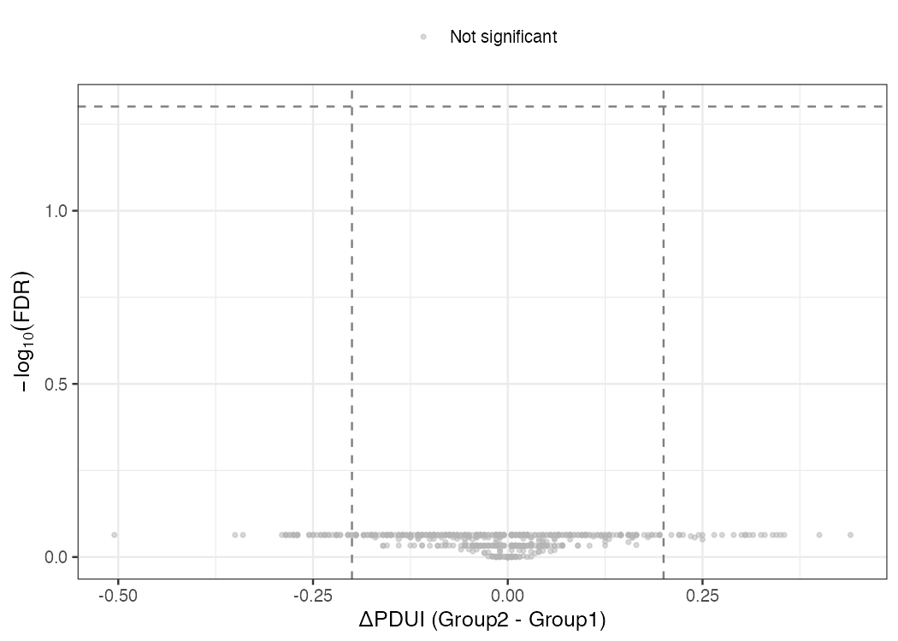
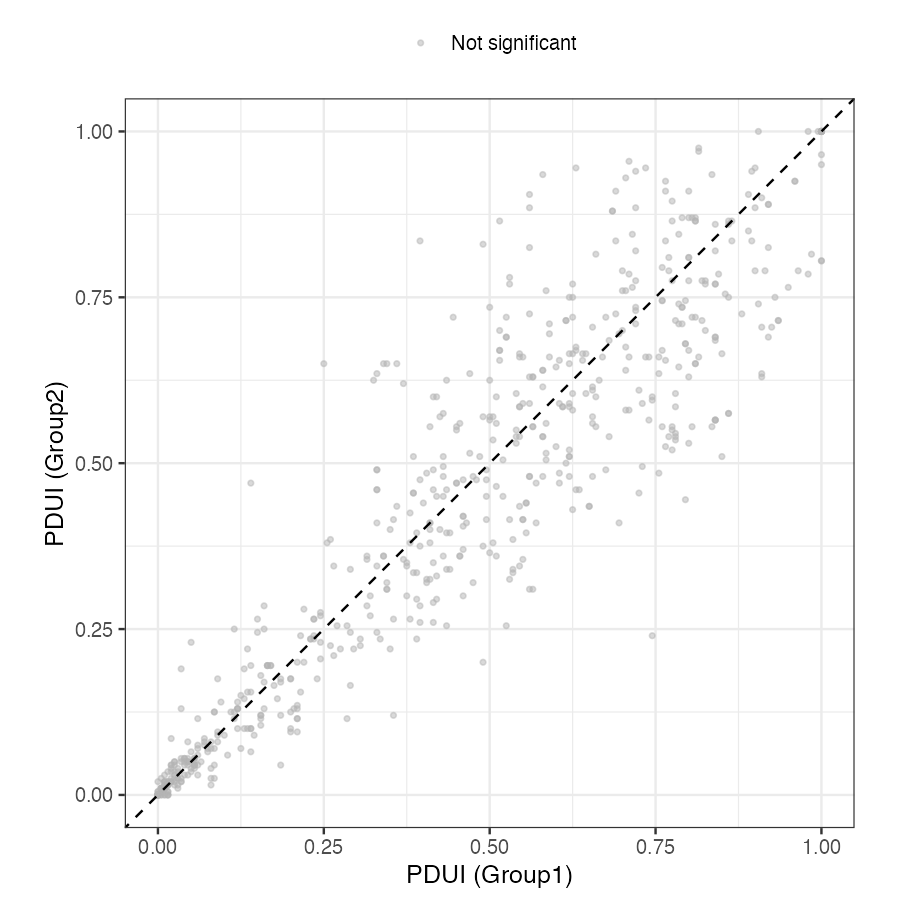

# 专题概述

可变多腺苷酸化（Alternative Polyadenylation, APA）是真核生物重要的转录后调控方式。许多基因不只有一个多腺苷酸化位点（Polyadenylation Site, PAS）；细胞选择不同 PAS 时，会产生 3' 非翻译区（3' UTR）长度不同的转录本。一般而言，长 3' UTR 含有更多 miRNA 结合位点和 RNA 结合蛋白（RBP）识别元件，因此更容易影响 mRNA 稳定性、定位和翻译效率。增殖活跃的细胞和部分肿瘤细胞常出现 3' UTR 缩短，这可能帮助转录本避开部分 miRNA 介导的抑制。

本专题重点比较两类 APA 分析思路：DaPars2 从 RNA-seq 覆盖度中寻找变化点（changepoint），适合发现未注释 PAS；QAPA 依赖已知 PAS 注释，适合在注释完善的物种中进行稳定定量。专题最后简要介绍长读长全长转录组技术（PacBio IsoSeq、Oxford Nanopore direct RNA-seq）和 SQANTI3 质量评估，为第 7 章的多组学整合分析作铺垫。

**学习目标**：理解 APA 的生物学机制及其在增殖与分化调控中的作用；掌握 PDUI 与 ΔPDUI 指标的定义与解读；能够运行 DaPars2 完整流程并解读显著 APA 基因；了解 QAPA 的适用场景与 DaPars2 的互补关系；理解长读长测序技术在全长转录本重建方面相对于短读长的本质优势。

---

# 可变多腺苷酸化的生物学基础

{#fig-alternative-polyadenylation width=85%}

## 多腺苷酸化位点的分子识别机制

mRNA 的 3' 端加工可以理解为"切割 + 加尾"两步。前体 mRNA（pre-mRNA）先在 PAS 附近被切割，随后 poly-A 聚合酶添加 poly-A 尾，形成成熟 mRNA。PAS 附近通常含有六核苷酸信号（Hexamer Signal），其中 AATAAA 最常见，ATTAAA、AGTAAA 等变体也较常见。裂解和多腺苷酸化特异性因子复合物（Cleavage and Polyadenylation Specificity Factor, CPSF）识别这些信号，并协助确定切割位置。

当一个基因含有多个功能性 PAS 时，近端 PAS（proximal PAS）和远端 PAS（distal PAS）会发生竞争（@fig-alternative-polyadenylation）。选择近端 PAS 会提前终止转录本，产生短 3' UTR；选择远端 PAS 则产生长 3' UTR。这一选择受多种 RBP 调控，例如 CFIm25/CFIm68 常促进远端 PAS 使用，FIP1 常促进近端 PAS 使用。

## APA 的功能后果与生物学意义

3' UTR 长度变化主要通过以下方式影响转录本命运：

- **miRNA 介导的抑制**：长 3' UTR 通常包含更多 miRNA 结合位点，更容易发生 mRNA 降解或翻译抑制。3' UTR 缩短可减少这类调控元件。
- **mRNA 稳定性**：许多 mRNA 降解信号位于 3' UTR。若 APA 去除这些区域，转录本半衰期可能延长。
- **蛋白质亚细胞定位**：某些基因（如 *MBP*、*Arc*）的 3' UTR 含有轴突靶向信号（zipcode 序列），APA 可影响蛋白质的局部合成位点。
- **内含子 APA（Intronic APA）**：若替代 PAS 位于内含子中，转录本可提前终止，产生 C 端截短的蛋白质异构体。这类事件可能直接改变蛋白质结构和功能。

:::note
**核心区别：**

APA 与可变剪接（专题 5.1）都可以从标准 Bulk RNA-seq BAM 文件中分析，但关注点不同。可变剪接主要看外显子-外显子连接处的 junction reads，并用 PSI 描述外显子是否被纳入；APA 主要看 3' UTR 覆盖度是否在某个位置突然下降。简言之，可变剪接更常改变蛋白质异构体，APA 更常改变转录后调控信号。
:::

---

# DaPars2：基于覆盖密度的 APA 检测

## 算法原理

DaPars2（Dynamic Analysis of Alternative Polyadenylation from RNA-seq，version 2）的直觉很简单：如果样本偏向使用近端 PAS，那么近端 PAS 之后的 3' UTR 延伸段会缺少 reads，覆盖度会明显下降；如果偏向使用远端 PAS，整个 3' UTR 的覆盖度会相对连续。DaPars2 因此在每个基因的 3' UTR 内寻找覆盖度变化点，并将该位置解释为潜在近端 PAS（@fig-changepoint-detection）。这一策略不要求事先知道 PAS 坐标。

{#fig-changepoint-detection width=85%}

### 阶梯模型：把覆盖度分解为长短两种异构体

要理解 DaPars2 如何定位变化点，关键是认识到 3' UTR 的覆盖度并非平滑下降，而是呈现**阶梯状**。假设某基因只使用两个 PAS：一个近端位点（proximal PAS）和一个远端位点（distal PAS）。短转录本在近端 PAS 处终止，只覆盖 3' UTR 的前半段；长转录本一直延伸到远端 PAS，覆盖整个 3' UTR。两种转录本在样本中按各自的丰度同时存在。

由此可推出覆盖度曲线的形状。在近端 PAS 之前的**共有区段**（common region），长、短转录本都贡献 reads，覆盖度等于两者丰度之和；越过近端 PAS 进入**延伸区段**（extended region）后，短转录本已经终止，只剩长转录本贡献 reads，覆盖度骤然下降到长转录本的丰度。因此理想情况下，覆盖度是一条带有单个"台阶"的折线，台阶的拐点就是近端 PAS 的位置（@fig-changepoint-detection）。下图用示意方式表达这一结构：

```
覆盖度
  │
  │■■■■■■■■■■■■           ← 共有区段：长丰度 + 短丰度
  │■■■■■■■■■■■■
  │■■■■■■■■■■■■─────────  ← 台阶（拐点 = 近端 PAS）
  │            ░░░░░░░░░  ← 延伸区段：仅长丰度
  └────────────┼────────→ 3' UTR 位置
            近端 PAS    远端 PAS
```

DaPars2 把这一结构写成一个简单的**两段回归模型**：设近端 PAS 位于位置 $P$，长转录本的覆盖丰度为 $w_L$，短转录本的覆盖丰度为 $w_S$，则任意位置 $i$ 的期望覆盖度为

$$
E[\text{coverage}(i)] =
\begin{cases}
w_L + w_S, & i \le P \quad (\text{共有区段}) \\
w_L, & i > P \quad (\text{延伸区段})
\end{cases}
$$

算法的任务是同时估计三个未知量：拐点位置 $P$、长丰度 $w_L$、短丰度 $w_S$。做法是**遍历所有候选拐点**：对 3' UTR 内每一个可能的 $P$，用最小二乘法拟合上式（在约束 $w_L, w_S \ge 0$ 下求出对应的 $w_L$ 与 $w_S$），计算拟合曲线与真实覆盖度的残差平方和；使残差最小的那个 $P$ 即被判定为近端 PAS。这本质上就是一维信号上的变化点检测——与 @fig-changepoint-detection 中识别尼罗河流量均值突变是同一类问题，只是这里的"信号"是沿 3' UTR 排列的读段密度。

:::note
**为什么不需要预先知道 PAS 坐标：** 阶梯模型只假设"存在一个让覆盖度骤降的拐点"，拐点的位置是从数据中估计出来的，而非来自注释文件。这正是 DaPars2 能在注释不完善的物种或样本特异 PAS 上工作的根本原因（参见本专题末尾与 QAPA 的对比）。
:::

### 从拟合丰度到 PDUI

拟合得到的两个丰度 $w_L$ 与 $w_S$ 直接给出了长、短两种异构体的相对用量，核心量化指标 **PDUI（Percent Distal site Usage Index）** 正是建立在它们之上：

$$\text{PDUI} = \frac{w_L}{w_L + w_S}$$

直观地说，分子 $w_L$ 是使用远端 PAS（长 3' UTR）的转录本丰度，分母是长、短两种转录本的丰度之和。因此 PDUI 衡量的是"在所有该基因的转录本中，有多大比例选择了远端 PAS"。其值在 0 到 1 之间：接近 1 表示远端 PAS 使用比例高，即长 3' UTR 更多；接近 0 表示近端 PAS 使用比例高，即短 3' UTR 更多。需要注意，DaPars2 在工具内部只为每个样本各自估计一个 PDUI，并不做组间比较。两组样本间的差异指标 **ΔPDUI** 定义为：

$$\Delta\text{PDUI} = \text{PDUI}_{\text{case}} - \text{PDUI}_{\text{control}}$$

ΔPDUI > 0 表示处理条件下 3' UTR 延长；ΔPDUI < 0 表示 3' UTR 缩短。ΔPDUI 与显著性检验均在工具外完成：本专题下游用两组样本的 PDUI 做 t 检验，并以 Benjamini-Hochberg FDR 做多重检验校正（详见后文 R 代码）。

## DaPars2 完整分析流程

DaPars2 本身没有 conda/pip 包，需从官方仓库获取脚本（`git clone https://github.com/3UTR/DaPars2.git`），其脚本基于 Python 3，依赖 `numpy`、`scipy` 和 `bedtools`。完整流程分四步：构建 3' UTR 注释、生成覆盖度文件、运行 DaPars2、合并各染色体结果。下面以本地 HISAT2 比对结果（`bulkRNA/bam/`，参见第4章）实际运行，所有路径均为可直接执行的绝对路径。

:::warning
**关于 DaPars2 的命令行接口：** DaPars2（v2）的接口与旧版 DaPars（v1）完全不同。它**不接受** `-A`/`-B`/`-c`/`-o` 等分组命令行参数，而是读取一个**配置文件**，并要求显式提供一个**染色体名单文件**和一个**测序深度文件**。更关键的是，**DaPars2 只输出每个样本各自的 PDUI 值，不在工具内部做两组比较与统计检验**——分组、ΔPDUI 计算和显著性检验全部由用户在下游（如 R）完成。这与 v1 直接给出 P 值的行为不同。
:::

**第一步：构建 3' UTR 注释。** `DaPars_Extract_Anno.py` 的输入不是 GTF，而是 RefSeq 基因模型的 12 列 BED（来自 UCSC refGene）和一个"转录本 ID → 基因名"映射表。本地 BAM 比对到 Ensembl 风格的 GRCh38 参考（contig 名为 `17` 而非 `chr17`），因此在转换时去掉 `chr` 前缀，使注释与 BAM 命名一致。

```bash
DAPARS="/Users/angdong/Documents/bio_example/DaPars2/src"
APA="/Users/angdong/Documents/bio_example/apa"
mkdir -p "${APA}/anno"
cd "${APA}/anno"

# Download UCSC hg38 refGene (genePred table)
curl -sL "https://hgdownload.soe.ucsc.edu/goldenPath/hg38/database/refGene.txt.gz" \
    -o refGene.txt.gz
gunzip -kf refGene.txt.gz

# Convert genePred -> BED12, stripping the "chr" prefix to match Ensembl BAMs
awk 'BEGIN{FS=OFS="\t"}
{
  chrom=$3; sub(/^chr/,"",chrom);
  if (chrom ~ /_/) next;                       # skip alt/random contigs
  n=$9; split($10,es,","); split($11,ee,",");
  sizes=""; starts="";
  for(i=1;i<=n;i++){ sizes=sizes (ee[i]-es[i]) ","; starts=starts (es[i]-$5) "," }
  print chrom,$5,$6,$2,0,$4,$7,$8,0,n,sizes,starts
}' refGene.txt > hg38_refseq_gene.bed12

# Transcript-to-symbol map (header line + two columns)
{ printf "#name\tname2\n"; awk 'BEGIN{FS=OFS="\t"}{print $2,$13}' refGene.txt | sort -u; } \
    > refseq_to_symbol.txt

# Extract the 3' UTR regions DaPars2 will scan
python "${DAPARS}/DaPars_Extract_Anno.py" \
    -b hg38_refseq_gene.bed12 \
    -s refseq_to_symbol.txt \
    -o hg38_3UTR_annotation.bed
# -> "Total extracted 3' UTR: 37100"
```

**第二步：生成覆盖度（Wig）文件与测序深度表。** DaPars2 读取 bedGraph 格式的覆盖度文件（习惯以 `.wig` 命名）。BAM 已按坐标排序，`bedtools genomecov` 输出即按染色体分块、按坐标递增，符合 DaPars2 的解析要求。测序深度文件每行一个样本，最后一列为该样本的比对读段数，用于跨样本归一化。

```bash
BAM_DIR="/Users/angdong/Documents/bio_example/bulkRNA/bam"
APA="/Users/angdong/Documents/bio_example/apa"
mkdir -p "${APA}/wig"
: > "${APA}/sequencing_depth.txt"

for S in SRR1039508 SRR1039510 SRR1039512 SRR1039514 SRR1039516; do
    BAM="${BAM_DIR}/${S}_1M.sorted.bam"
    bedtools genomecov -ibam "${BAM}" -bg -split > "${APA}/wig/${S}.wig"
    DEPTH=$(samtools view -c -F 0x104 "${BAM}")   # primary mapped reads
    printf "%s\t%s\n" "${S}" "${DEPTH}" >> "${APA}/sequencing_depth.txt"
done
```

**第三步：编写配置文件并运行 DaPars2。** 配置文件用 `key=value` 行声明输入；`Aligned_Wig_files` 以逗号分隔，其顺序决定输出列的顺序，须与测序深度表一致。

```bash
APA="/Users/angdong/Documents/bio_example/apa"
W="${APA}/wig"
cd "${APA}"

cat > dapars2_config.txt <<EOF
Annotated_3UTR=${APA}/anno/hg38_3UTR_annotation.bed
Aligned_Wig_files=${W}/SRR1039508.wig,${W}/SRR1039510.wig,${W}/SRR1039512.wig,${W}/SRR1039514.wig,${W}/SRR1039516.wig
Output_directory=${APA}/dapars2_output
Output_result_file=dapars2_airway
Coverage_threshold=10
Num_Threads=4
sequencing_depth_file=${APA}/sequencing_depth.txt
EOF

# Chromosome list (one per line; must match the BAM/annotation naming)
printf "%s\n" 1 2 3 4 5 6 7 8 9 10 11 12 13 14 15 16 17 18 19 20 21 22 X Y > chr_list.txt

# Run: the script takes the config file and the chromosome list as positional args
python "${DAPARS}/DaPars2_Multi_Sample_Multi_Chr.py" dapars2_config.txt chr_list.txt
```

:::note
**macOS / Python ≥ 3.8 的多进程兼容性：** DaPars2 内部用 `multiprocessing.Manager`，但脚本顶层缺少 `if __name__ == "__main__"` 保护。在 macOS（及 Python 3.8+ 默认的 `spawn` 启动方式）下会因子进程重新导入脚本而崩溃（`EOFError`）。解决办法是在调用前强制使用 `fork` 启动方式，用如下三行包装脚本即可（Linux 默认即为 `fork`，无需此步）：

```python
import sys, multiprocessing
multiprocessing.set_start_method("fork", force=True)
script = "/Users/angdong/Documents/bio_example/DaPars2/src/DaPars2_Multi_Sample_Multi_Chr.py"
sys.argv = [script] + sys.argv[1:]
exec(compile(open(script).read(), script, "exec"))
```
:::

**第四步：合并各染色体结果。** DaPars2 为每条染色体单独建立 `dapars2_output_<chr>/` 目录并输出 `..._result_temp.<chr>.txt`。将它们合并为一张总表，便于下游读取。

```bash
APA="/Users/angdong/Documents/bio_example/apa"
cd "${APA}"
FIRST=$(ls dapars2_output_*/dapars2_airway_result_temp.*.txt | head -1)
head -1 "${FIRST}" > dapars2_airway_All_Prediction_Results.txt
for f in dapars2_output_*/dapars2_airway_result_temp.*.txt; do
    tail -n +2 "${f}"
done >> dapars2_airway_All_Prediction_Results.txt
# This run yields 1139 predicted APA genes; 642 have a PDUI value in all 5 samples.
```

:::tip
**链特异性的取舍：** 上面用 `bedtools genomecov -bg` 生成的是合并双链的总覆盖度，流程简单、足以演示 DaPars2 的完整运行。但 APA 分析对读段方向敏感，因为 3' UTR 常与相邻基因或反义转录信号接近。airway 数据集使用 dUTP 方案建库（fr-firststrand，HISAT2 参数为 `--rna-strandness RF`），在正式分析中应按链拆分 BAM（如 `samtools view -f 128 -F 16` 与 `-f 80` 组合）后分别生成覆盖度，避免错误链 reads 制造虚假覆盖度变化。可用 RSeQC 的 `infer_experiment.py` 先确认文库的链特异性。
:::

## DaPars2 结果解读

DaPars2 输出表的核心列是 `Gene`（格式 `refseq|symbol|chr|strand`）、`Predicted_Proximal_APA`（预测的近端 PAS 坐标）、`Loci`（3' UTR 区间）以及每个样本一列的 `*_PDUI` 值。由于 DaPars2 不在工具内部分组，分组比较需在 R 中完成：定义两组、对每个基因计算组均 PDUI 与 ΔPDUI、用 t 检验得到 P 值并做 BH 校正。本演示沿用与可变剪接专题一致的零假设设置——把 4 个 untreated 样本拆成两组（508/510 与 512/514），借以走通统计流程而非得出生物学结论。

:::warning
**关于本演示的分组：** 本地 PE 数据中仅 SRR1039516 为 dexamethasone 处理样本，无法构成处理组的生物学重复，无法进行有意义的两组检验。因此这里将 4 个 untreated 样本人为拆为两组（各 2 个重复），本质是一次零假设（null）对比，仅用于演示 DaPars2 的完整流程。在真实研究中两组应对应不同实验条件，且每组建议 ≥ 3 个重复。
:::

```r
# Parse DaPars2 output and run the group comparison downstream
library(dplyr)
library(readr)
library(tidyr)

res <- read_tsv(
    "/Users/angdong/Documents/bio_example/apa/dapars2_airway_All_Prediction_Results.txt",
    show_col_types = FALSE
)
# Rename the per-sample PDUI columns (full paths -> sample IDs)
names(res) <- sub(".*/(SRR[0-9]+)_PDUI$", "\\1", names(res))

# Define two groups (null demo: two subsets of untreated samples)
g1 <- c("SRR1039508", "SRR1039510")
g2 <- c("SRR1039512", "SRR1039514")

dapars_result <- res |>
    separate(Gene, into = c("refseq", "symbol", "chr", "strand"),
             sep = "\\|", remove = FALSE) |>
    mutate(across(all_of(c(g1, g2)), as.numeric)) |>
    # DaPars2 reports NA where coverage is insufficient; keep complete cases
    filter(if_all(all_of(c(g1, g2)), ~ !is.na(.))) |>
    rowwise() |>
    mutate(
        pdui_g1    = mean(c_across(all_of(g1))),
        pdui_g2    = mean(c_across(all_of(g2))),
        delta_pdui = pdui_g2 - pdui_g1,
        pvalue     = tryCatch(
            t.test(c_across(all_of(g1)), c_across(all_of(g2)))$p.value,
            error = function(e) NA_real_)
    ) |>
    ungroup() |>
    mutate(fdr = p.adjust(pvalue, method = "BH"))

# Filter significant APA events: FDR < 0.05 AND |dPDUI| > 0.2
sig_apa <- dapars_result |>
    filter(!is.na(fdr), fdr < 0.05, abs(delta_pdui) > 0.2) |>
    mutate(apa_direction = if_else(delta_pdui > 0,
                                   "3' UTR Lengthening", "3' UTR Shortening"))

cat("Genes analyzed (complete cases):", nrow(dapars_result), "\n")
cat("Total significant APA events:",   nrow(sig_apa), "\n")
cat("3' UTR lengthening:", sum(sig_apa$delta_pdui > 0), "\n")
cat("3' UTR shortening:",  sum(sig_apa$delta_pdui < 0), "\n")
# In this null demo: 642 genes analyzed, 0 significant after FDR correction.
```

基于上面 `dapars_result` 表，可绘制火山图（ΔPDUI vs FDR）和组间 PDUI 散点图。下面代码使用真实数据生成 @fig-dapars2-volcano 与 @fig-dapars2-scatter。

```r
#| eval: false
library(ggplot2)

dapars_result <- dapars_result |>
    mutate(color_group = case_when(
        fdr < 0.05 & delta_pdui >  0.2 ~ "Lengthening (sig.)",
        fdr < 0.05 & delta_pdui < -0.2 ~ "Shortening (sig.)",
        TRUE                           ~ "Not significant"))

pal <- c("Lengthening (sig.)" = "#d62728",
         "Shortening (sig.)"  = "#1f77b4",
         "Not significant"    = "grey70")

# Volcano: dPDUI vs -log10(FDR)
ggplot(dapars_result, aes(delta_pdui, -log10(fdr), color = color_group)) +
    geom_point(alpha = 0.5, size = 0.9) +
    geom_hline(yintercept = -log10(0.05), linetype = "dashed", color = "grey50") +
    geom_vline(xintercept = c(-0.2, 0.2), linetype = "dashed", color = "grey50") +
    scale_color_manual(values = pal) +
    labs(x = "ΔPDUI (Group2 - Group1)", y = expression(-log[10](FDR)),
         color = NULL) +
    theme_bw(base_size = 12) + theme(legend.position = "top")

# Scatter: per-group mean PDUI
ggplot(dapars_result, aes(pdui_g1, pdui_g2, color = color_group)) +
    geom_point(alpha = 0.5, size = 0.9) +
    geom_abline(slope = 1, intercept = 0, linetype = "dashed") +
    scale_color_manual(values = pal) +
    coord_fixed(xlim = c(0, 1), ylim = c(0, 1)) +
    labs(x = "PDUI (Group1)", y = "PDUI (Group2)", color = NULL) +
    theme_bw(base_size = 12) + theme(legend.position = "top")
```

{#fig-dapars2-volcano width=85%}

{#fig-dapars2-scatter width=70%}

**结果解读：** 本次运行从 1139 个被预测出近端 PAS 的基因中，得到 642 个在全部 5 个样本均有有效 PDUI 的基因。在零假设分组（508/510 vs 512/514）下，ΔPDUI 中位数约为 0，分布近似对称（@fig-dapars2-scatter），经 BH 校正后无一基因满足 `FDR < 0.05 且 |ΔPDUI| > 0.2`。这一"零结果"恰恰验证了流程的正确性：当两组之间不存在真实的 APA 调控差异时，DaPars2 加下游统计不会凭空制造假阳性。需要强调的是，PDUI 大幅偏离对角线的个别基因（如 `WDR83OS`、`PTMS`）其 |ΔPDUI| 可达 0.4–0.5，但仅 2 个重复时 t 检验功效极低，P 值不显著——这提示在小样本 APA 分析中，应同时报告效应量与覆盖度，切勿仅凭 ΔPDUI 解读单个基因。

---

# QAPA：基于已注释 3' UTR 的精确定量

## QAPA 的设计思路与 DaPars2 的互补关系

QAPA（Quantification of Alternative Polyadenylation）采用注释驱动的思路。它先根据 PolyA_DB 或 PolyASite 等数据库构建 3' UTR 参考序列，再用 Salmon 对这些候选 3' UTR 进行定量，最后报告每个 PAS 的相对使用比例（PAU，Poly-A Usage）。

因此，QAPA 适合"已知 PAS 的精确定量"，DaPars2 适合"未知 PAS 的发现"。两者不是互相替代，而是回答不同问题：

| 场景 | 推荐工具 |
|---|---|
| 模式生物，PAS 注释完善 | QAPA（定量精度高） |
| 非模式生物或样本类型特异 PAS | DaPars2（无需预注释） |
| 发现新型 PAS | DaPars2 |
| 低测序深度样本 | QAPA（伪比对更敏感） |

```bash
# QAPA workflow
# Requires: qapa, salmon, PolyASite 2.0 annotation

# Step 1: Build QAPA reference from PolyASite annotation
qapa build \
    --db /path/to/atlas.clusters.2.0.GRCh38.96.bed \
    -g /Users/angdong/Documents/bio_example/bulkRNA/ref/GRCh38.109.gtf \
    -f /Users/angdong/Documents/bio_example/bulkRNA/ref/Homo_sapiens.GRCh38.dna.primary_assembly.fa \
    > qapa_3utrs.fa

# Step 2: Build Salmon index on QAPA reference
salmon index \
    -t qapa_3utrs.fa \
    -i qapa_salmon_index \
    --threads 8

# Step 3: Quantify each sample with Salmon
for sample in SRR1039508 SRR1039510 SRR1039512 SRR1039514 SRR1039516; do
    TRIM_DIR="/Users/angdong/Documents/bio_example/bulkRNA/qc/fastp"
    salmon quant \
        -i qapa_salmon_index \
        -l ISR \
        -1 ${TRIM_DIR}/${sample}_1_1M_trimmed.fastq.gz \
        -2 ${TRIM_DIR}/${sample}_2_1M_trimmed.fastq.gz \
        -p 8 \
        --validateMappings \
        -o qapa_quant/${sample}
done

# Step 4: Compute PAU (Poly-A Usage) per PAS
qapa quant \
    --db /path/to/atlas.clusters.2.0.GRCh38.96.bed \
    qapa_quant/*/quant.sf \
    > qapa_pau_results.txt
```

上述流程依赖外部 PAS 注释文件，因此更适合作为方法展示。若研究目标是发现样本特异的新 PAS，应优先使用 DaPars2 或其他无注释发现工具，再用独立数据进行验证。

```r
# Compare DaPars2 and QAPA results for genes detected by both methods
library(dplyr)
library(ggplot2)

# Read QAPA output (PAU per PAS per sample)
qapa_result <- read.table("qapa_pau_results.txt",
                           header = TRUE, sep = "\t") |>
    filter(!is.na(PAU)) |>
    group_by(Gene) |>
    # Compute delta PAU for proximal vs distal PAS
    summarize(
        delta_pau = mean(PAU[grepl("proximal", APA_ID)], na.rm = TRUE) -
                    mean(PAU[grepl("distal",   APA_ID)], na.rm = TRUE),
        .groups = "drop"
    )
```

---

# APA 下游功能分析

## 差异 APA 基因的 GO 富集分析

识别显著 APA 基因后，可以用 GO 富集分析概括这些基因涉及的生物学过程。需要注意的是，APA 改变的是转录本调控潜力，不一定改变基因总表达量。因此，差异 APA 基因集和差异表达基因集（DEA，参见第4章）可能指向不同的功能类别。

```r
library(clusterProfiler)
library(org.Hs.eg.db)
library(dplyr)

# Significant APA genes (use results from DaPars2 analysis above)
# Here we use simulated gene list for demonstration
sig_apa_genes <- c(
    "DICER1", "IGF2BP1", "CCND1", "MYC", "VEGFA",
    "ELAVL1", "PTBP1", "KHSRP", "ZFC3H1", "NUDT21"
)

# Convert gene symbols to Entrez IDs
gene_entrez <- bitr(sig_apa_genes, fromType = "SYMBOL",
                    toType = "ENTREZID", OrgDb = org.Hs.eg.db)

# GO enrichment (Biological Process)
go_bp <- enrichGO(
    gene          = gene_entrez$ENTREZID,
    OrgDb         = org.Hs.eg.db,
    ont           = "BP",
    pAdjustMethod = "BH",
    pvalueCutoff  = 0.05,
    readable      = TRUE
)
```

```r
#| label: fig-apa-go
#| fig-cap: "差异 APA 基因集 GO 生物过程富集分析结果（前 15 条目）。点的大小代表富集基因数量，颜色代表校正后 p 值。"
library(ggplot2)
library(dplyr)

# Simulated GO enrichment results
go_sim <- data.frame(
    Description = c(
        "mRNA 3'-end processing", "regulation of mRNA stability",
        "RNA splicing", "miRNA-mediated gene silencing",
        "cell proliferation", "response to glucocorticoid",
        "translation regulation", "cytoplasmic mRNA processing body",
        "poly(A) RNA binding", "RNA binding"
    ),
    Count = c(8, 7, 6, 6, 5, 5, 4, 4, 3, 3),
    p_adj = c(0.0001, 0.0003, 0.001, 0.002, 0.005,
              0.006, 0.01, 0.012, 0.02, 0.03)
) |>
    mutate(Description = reorder(Description, -p_adj))

ggplot(go_sim, aes(x = -log10(p_adj), y = Description,
                    size = Count, color = p_adj)) +
    geom_point() +
    scale_color_gradient(low = "#d62728", high = "#aec7e8",
                         name = "Adjusted p") +
    scale_size_continuous(range = c(3, 8), name = "Gene count") +
    labs(x = expression(-log[10]("Adjusted p-value")),
         y = NULL,
         caption = "Simulated data for illustration") +
    theme_bw(base_size = 11) +
    theme(legend.position = "right")
```

## APA 与差异剪接结果的联合解读

将专题 5.1 的 rMATS 结果与本专题的 DaPars2 结果取交集，可以找到同时发生可变剪接和 APA 的基因。这类基因可能同时改变蛋白质异构体和 3' UTR 调控元件，值得优先检查。

```r
library(ggplot2)
library(VennDiagram)
library(grid)

# Simulated gene sets from rMATS and DaPars2
# Replace with actual results from respective analyses
rmats_sig_genes  <- paste0("GENE_", sample(1:500, 120, replace = FALSE))
dapars_sig_genes <- paste0("GENE_", sample(1:500, 95,  replace = FALSE))

overlap_genes <- intersect(rmats_sig_genes, dapars_sig_genes)
cat("Genes regulated by both AS and APA:", length(overlap_genes), "\n")

# Fisher's exact test for enrichment significance
contingency <- matrix(
    c(length(overlap_genes),
      length(rmats_sig_genes)  - length(overlap_genes),
      length(dapars_sig_genes) - length(overlap_genes),
      500 - length(union(rmats_sig_genes, dapars_sig_genes))),
    nrow = 2
)
fisher.test(contingency)
```

---

# 长读长转录组学展望

:::note
**长读长转录组学展望：全长异构体与 RNA 修饰直接检测**

短读长测序通常只能看到转录本的局部片段。当两个异构体共享大部分外显子、只在少数剪接位点不同的时候，短读段很难判断每个片段来自哪一条完整转录本。长读长测序可以直接读取完整 cDNA 或 RNA 分子，因此更适合解析全长异构体结构。

**PacBio IsoSeq** 先把 cDNA 做成闭合环形模板（SMRTbell），再对同一分子多轮测序并生成共识序列（CCS，Circular Consensus Sequencing）。多轮共识可以显著降低随机错误，形成高准确率的 HiFi reads。常见流程包括引物去除（`lima`）、全长非嵌合读段过滤（`isoseq3 refine`）、聚类（`isoseq3 cluster`）和基因组比对（`pbmm2`）。

**Oxford Nanopore direct RNA-seq** 可直接测 RNA 分子，不需要逆转录，因此能够保留 m⁶A、假尿苷等修饰相关信号。它在 RNA 修饰组学（Epitranscriptomics）中具有独特优势。常用比对工具为 minimap2，direct RNA-seq 通常使用 `-ax splice -uf` 等参数。

**SQANTI3**（Structural and Quality Annotation of Novel Transcript Isoforms version 3）用于评估长读长转录本结构。它会把转录本分为 FSM（Full Splice Match）、ISM（Incomplete Splice Match）、NIC（Novel In Catalog）、NNC（Novel Not in Catalog）等类别，并结合 CAGE peak、poly-A signal 等证据判断 5' 端和 3' 端是否可信。

本专题只强调长读长技术的核心价值：它能把"局部片段"提升为"完整转录本"。IsoSeq3、Nanopore 碱基识别、SQANTI3 过滤和短长读长联合分析将在第 7 章系统展开。
:::

---

# 课后自测 (Post-Lesson Quiz)

1. 近端 PAS（proximal PAS）和远端 PAS（distal PAS）的选择如何影响 3' UTR 长度？为什么肿瘤细胞中常见 3' UTR 缩短？

2. PDUI 指标的定义是什么？ΔPDUI = -0.35 在生物学上意味着什么？

3. DaPars2 在识别多腺苷酸化位点时使用了什么算法策略？与 QAPA 相比，在哪些实验场景下 DaPars2 具有优势？

4. 为什么在 APA 分析中链特异性（strandedness）参数的正确设置比在常规差异表达分析中更为关键？

5. 内含子 APA（Intronic APA）与 3' UTR APA 的主要功能差异是什么？

6. 如果一个基因同时发生差异剪接和 3' UTR 缩短，生物学上可能意味着什么？

7. PacBio HiFi reads 为什么比单次测序读段更准确？FLNC 读段的定义是什么？

8. SQANTI3 中 NIC 与 NNC 类别的区别是什么？为什么 NNC 类别的转录本需要最多的额外验证？

<details>
<summary><strong>参考答案 (Reference Answers)</strong></summary>

1. *近端 PAS 被选择时，转录本提前终止，形成短 3' UTR；远端 PAS 被选择时，转录本保留更长的 3' UTR。长 3' UTR 往往含有更多 miRNA 结合位点。肿瘤细胞中 3' UTR 缩短可减少这些抑制元件，使部分促增殖基因更容易维持较高表达。*

2. *PDUI（Percent Distal site Usage Index）= 长 3' UTR 转录本读段数 /（长 + 短 3' UTR 转录本读段数），值域 [0, 1]，越高表示越偏向使用远端 PAS（长 3' UTR）。ΔPDUI = -0.35 表示在处理条件下，该基因的 PDUI 比对照组降低了 0.35，即处理使细胞明显偏向使用近端 PAS，导致该基因 3' UTR 显著缩短。*

3. *DaPars2 使用变化点检测（changepoint detection）：在 3' UTR 覆盖度曲线上寻找突然下降的位置，并把该位置解释为潜在近端 PAS。它不依赖预先注释的 PAS，因此适合 PAS 注释不完善的物种、样本特异性 PAS 发现，以及参考数据库覆盖不足的研究。*

4. *APA 分析依赖 3' UTR 局部覆盖度。如果链特异性设置错误，来自相邻基因或反义链的 reads 会污染目标 3' UTR，可能产生虚假变化点或掩盖真实变化点。常规差异表达分析多使用基因整体计数，对这类局部方向错误相对不敏感。*

5. *3' UTR APA 通常不改变蛋白质编码序列，主要改变 miRNA 调控、mRNA 稳定性和翻译效率。内含子 APA 会使转录本在内含子中提前终止，可能产生 C 端截短蛋白，因而更容易直接改变蛋白质结构和功能。*

6. *这说明该基因可能同时在两个层面发生变化：可变剪接改变蛋白质异构体，APA 改变 3' UTR 调控元件。若两类事件发生在同一基因上，说明该基因可能处于较强的 RNA 加工调控之下。是否发生在同一条转录本分子上，需要长读长测序进一步确认。*

7. *PacBio IsoSeq 使用闭合环形模板，使同一分子可被多轮读取。多个亚读段取共识后，随机错误被校正，因此 HiFi reads 比单次测序读段更准确。FLNC（Full-Length Non-Chimeric）读段指同时含有 5' 引物和 3' 引物、且内部不含接头序列的全长非嵌合读段。*

8. *NIC（Novel In Catalog）使用的是已知剪接位点的新组合；NNC（Novel Not in Catalog）包含从未在注释中出现过的新剪接供体或受体位点。NNC 更需要额外验证，因为它既可能是真实的新异构体，也可能来自测序错误、比对错误或 RT-switching 等技术伪影。*

</details>
